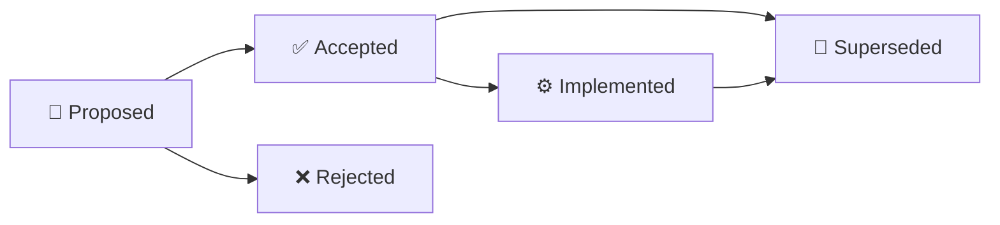

<!-- GPT_EA_DOC_HEADER -->

# 🧠⚡ GPT_EA
### 🏛️ Architecture Decision Records

**AI-Assisted MT5 Intelligence • Risk • Execution • Recovery • Governance**

[🏠 Home](README.md) · [🏗 Architecture](ARCHITECTURE.md) · [🗺 Roadmap](ROADMAP.md) · [🔐 Privacy](PRIVACY_DATA_RETENTION_REVIEW.md) · [📦 Release Evidence](RELEASE_EVIDENCE_PACK.md)

> 🏛️ **Document:** `ADR_INDEX.md`

---

# 🏛️ Architecture Decision Records

Architecture Decision Records (ADRs) capture **why** GPT_EA is built the way it is. They are durable governance records: implementation may evolve, but a decision should be superseded explicitly rather than silently reversed.

## 📚 Decision registry

| ADR | Status | Decision |
|---|---|---|
| [ADR-001](ADR_001_FAIL_CLOSED_NEW_ENTRY_GOVERNANCE.md) | Accepted | Fail closed for new entries when mandatory safety/evidence gates fail |
| [ADR-002](ADR_002_CUSTOMER_OWNED_OPENAI_API_KEYS.md) | Accepted | Customer-owned OpenAI API keys are the standard deployment model |
| [ADR-003](ADR_003_HUMAN_APPROVAL_BEFORE_EXECUTION.md) | Accepted | Human approval remains a first-class execution gate |
| [ADR-004](ADR_004_EXISTING_POSITION_SAFETY_DURING_BLOCKS.md) | Accepted | New-entry blocks must not abandon existing-position protection |
| [ADR-005](ADR_005_EVIDENCE_BOUND_RELEASES.md) | Accepted | Production authorization is bound to exact artifact identity and evidence |
| [ADR-006](ADR_006_VERSIONED_LEGAL_RISK_PRIVACY_ACK.md) | Accepted | Legal, risk and privacy approvals are versioned and evidence-bound |
| [ADR-007](ADR_007_PRIVACY_MINIMIZED_LICENSING_TELEMETRY.md) | Accepted | Licensing/telemetry must minimize customer data and exclude secrets |
| [ADR-008](ADR_008_SHADOW_FIRST_ADAPTIVE_LEARNING.md) | Accepted | Adaptive/challenger research is shadow-first; no silent live auto-promotion |

## 🧭 ADR lifecycle

A material architectural reversal requires a new ADR that names the record it supersedes.

## 🧾 Standard ADR fields

Each ADR records:

- status;
- decision date;
- context/problem;
- decision;
- rationale;
- consequences;
- rejected alternatives;
- implementation/evidence hooks;
- supersession rules.

## 🔐 Governance rule

ADRs do **not** prove a release is safe or certified. They explain architecture. Release truth remains controlled by the machine-readable evidence chain and [RELEASE_TRUTH_DASHBOARD.md](RELEASE_TRUTH_DASHBOARD.md).

---

> 🏛️ **Rule:** architecture changes should be explicit, reviewable and historically traceable.
