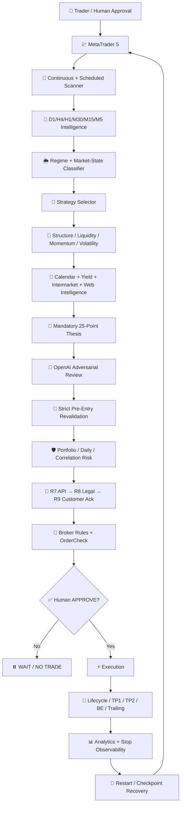
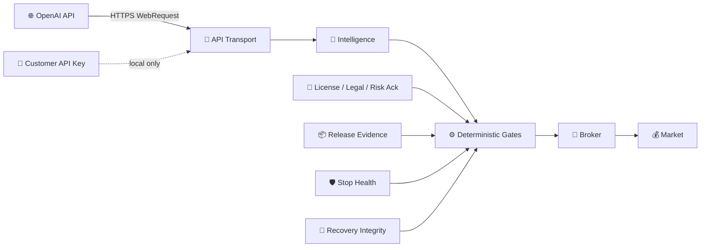
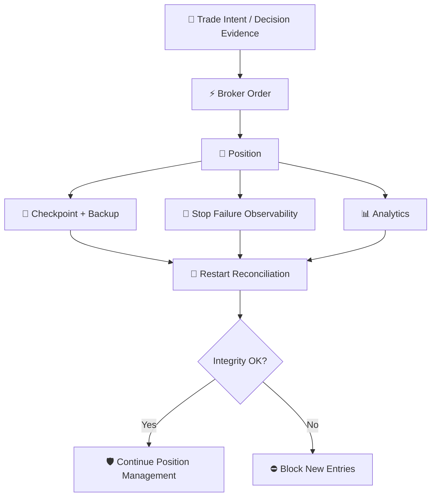
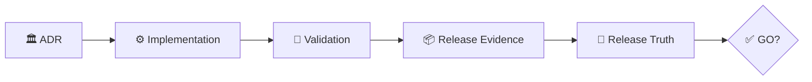

<!-- GPT_EA_DOC_HEADER -->
<div align="center">

# 🧠⚡ GPT_EA
### 🛡️ AI-Assisted Multi-Timeframe MT5 Trading Intelligence

**Research • Risk • Execution • Recovery • Governance**

[🏠 Home](README.md) · [🏗 Architecture](ARCHITECTURE.md) · [🗺 Roadmap](ROADMAP.md) · [🔐 Privacy](PRIVACY_DATA_RETENTION_REVIEW.md) · [📦 Release Evidence](RELEASE_EVIDENCE_PACK.md)

</div>

---

# 🏗️ System Architecture

GPT_EA is designed as a layered, fail-closed MetaTrader 5 Expert Advisor. AI assists analysis; deterministic broker, risk, recovery, release and legal gates retain final authority.

## 🌐 End-to-end architecture



## 🧩 Trust boundary



**Trust rule:** GPT output never overrides deterministic safety, release, broker, stop, recovery or legal gates.

## 🛡️ Safety stack

1. 📡 Fresh synchronized market data.
2. 🧠 Strategy and regime alignment.
3. 📰 News/intermarket contradiction checks.
4. 🧾 Mandatory thesis and adversarial GPT review.
5. 🔁 Fresh pre-entry revalidation.
6. 💼 Portfolio/daily/correlation risk.
7. 🔐 Release evidence and deployment identity.
8. 🌐 API transport gate.
9. ⚖️ Legal/license acknowledgement.
10. 👤 Customer risk acknowledgement.
11. 🏦 Broker capability + OrderCheck.
12. ✅ Human approval.
13. 🛑 Monotonic stop protection and recovery.

## 🔐 Customer credential architecture

```text
Customer MT5
   │
   ├── customer-owned OpenAI API key
   │
   └── HTTPS → https://api.openai.com/v1/responses
```

The key must not be committed, logged, placed in screenshots, or shipped in vendor presets.

## 💾 Evidence and recovery architecture



## 🏛️ Architecture decisions

The major irreversible or safety-relevant design choices are recorded in **[ADR_INDEX.md](ADR_INDEX.md)** rather than being left implicit in code comments.

Supersession and history-preservation are governed by **[ADR_SUPERSESSION_POLICY.md](ADR_SUPERSESSION_POLICY.md)** and the machine-readable `ADR_REGISTRY.json`.

Current accepted ADR themes include fail-closed new-entry governance, customer-owned API keys, human approval, existing-position safety during governance blocks, evidence-bound releases, versioned legal/risk/privacy approval, privacy-minimized licensing/telemetry, and shadow-first adaptive learning.



See also **[RELEASE_TRUTH_DASHBOARD.md](RELEASE_TRUTH_DASHBOARD.md)**.
Dashboard/evidence drift is defined in **[DASHBOARD_DRIFT_DETECTION.md](DASHBOARD_DRIFT_DETECTION.md)**.

## ⚠️ Non-goals

GPT_EA does not guarantee profitable outcomes, remove market risk, make AI infallible, replace broker infrastructure, or permit release gates to be bypassed for convenience.

---

> 🧭 **Design principle:** fail closed for new entries, continue safe management of existing positions.
