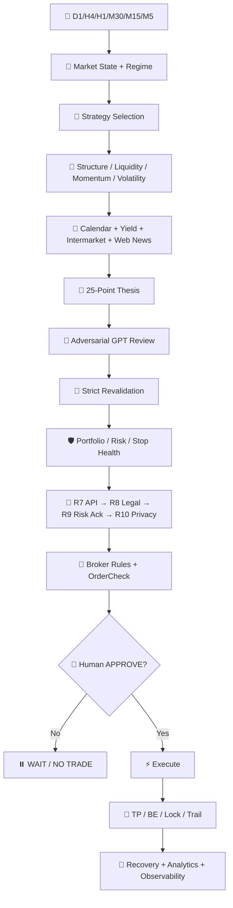
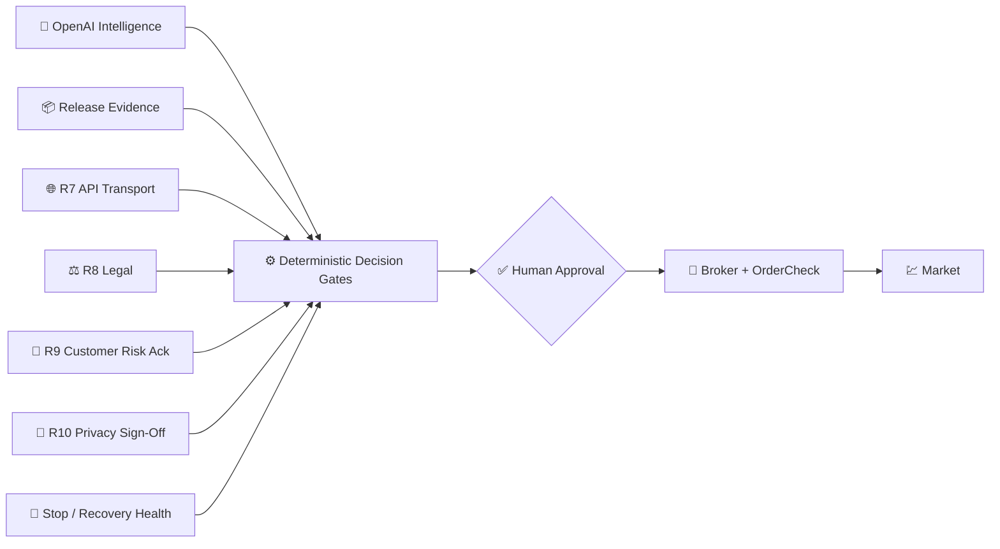
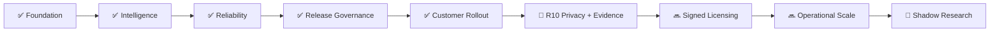
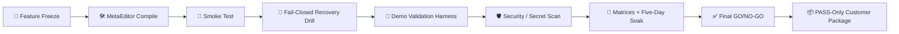
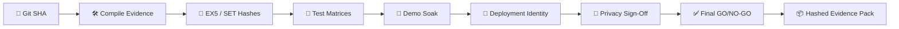

<!-- GPT_EA_DOC_HEADER -->
<div align="center">


<br>

[](#)
[](#)
[](#)
[](#)
[](#)

### 🧠 Multi-Timeframe Intelligence · 📰 News & Intermarket · 🛡️ Risk · ⚡ Execution · 💾 Recovery · 🔐 Release Governance

[🏗 Architecture](docs/ARCHITECTURE.md) · [🏛 ADRs](docs/ADR_INDEX.md) · [🚦 Release Truth](docs/RELEASE_TRUTH_DASHBOARD.md) · [🗺 Roadmap](docs/ROADMAP.md) · [🚀 Installation](docs/INSTALLATION.md) · [🔐 Privacy](docs/PRIVACY_DATA_RETENTION_REVIEW.md) · [📦 Release Evidence](docs/RELEASE_EVIDENCE_PACK.md) · [⚖️ Terms](docs/TERMS_AND_CONDITIONS.md)

</div>

---

# 🧠⚡ GPT_EA

**GPT_EA** is a standalone MetaTrader 5 Expert Advisor that combines deterministic trading logic with OpenAI-assisted market intelligence. It scans **D1 / H4 / H1 / M30 / M15 / M5**, classifies market regime and strategy, evaluates live news/intermarket risk, builds a mandatory trade thesis, challenges the setup with GPT, then routes any candidate through deterministic risk, broker, release, legal, customer-acknowledgement and privacy gates before human-approved execution.

> 🛡️ **Core rule:** AI can assist analysis; it cannot override broker rules, release evidence, stop protection, recovery integrity, risk limits, legal acknowledgement or human approval.

## ✨ Why GPT_EA is different

| Layer | Capability |
|---|---|
| 🧭 **Market intelligence** | D1→M5 structure, regime, trend/retracement/reversal/breakout/range classification |
| 🧠 **Strategy engine** | Continuation, retracement, counter-trend, reversal, breakout, breakout-retest, range, mean reversion |
| 📰 **Live context** | Economic calendar, yields, intermarket signals and OpenAI web intelligence |
| 🧾 **Trade thesis** | Mandatory 25-point thesis plus adversarial GPT review |
| 🔁 **Freshness** | Strict pre-entry revalidation cancels stale approvals |
| 🛡️ **Risk** | Portfolio, correlation, daily loss, drawdown, realistic R:R and broker-aware sizing |
| ⚡ **Execution** | Human APPROVE / DENY, `OrderCheck()`, broker-specific filling/stops/margin |
| 🛑 **Protection** | TP1/TP2, BE, profit lock, trailing, stop-failure policy and partial-protection hazard gate |
| 💾 **Recovery** | Restart-safe checkpointing, broker reconciliation and lifecycle replay |
| 🔐 **Governance** | R7 API → R8 Legal → R9 Customer Risk Ack → **R10 Privacy Sign-Off** |
| 📦 **Evidence** | Compile, static, tester, broker, soak, legal/privacy and final GO/NO-GO evidence packs |

## 🏗️ Architecture at a glance



Full architecture: **[docs/ARCHITECTURE.md](docs/ARCHITECTURE.md)**

## 🔐 Trust & governance stack



**No single AI response can force an order.** New-entry authorization remains fail-closed when a mandatory gate is missing or stale.

## 🚦 Release truth

**[Open the release-truth dashboard →](docs/RELEASE_TRUTH_DASHBOARD.md)** · Current checked-in baseline: **⏸️ HOLD** until exact-candidate external evidence is validated.

Dashboard integrity: **[drift-detection contract](docs/DASHBOARD_DRIFT_DETECTION.md)** · architecture governance: **[ADR supersession policy](docs/ADR_SUPERSESSION_POLICY.md)**.

| Item | Current contract |
|---|---|
| 🧬 Source identity | Exact Git SHA required |
| 🛠️ Compile | Real MetaEditor compile evidence required: **0 errors / 0 production warnings** |
| 🔏 Artifact identity | EX5 SHA-256 + SET SHA-256/NONE |
| 🧪 Validation | Strategy Tester + intelligence/broker/recovery/stop matrices |
| 🌐 API | DIRECT_OPENAI or validated proxy transport evidence |
| 🌊 Demo soak | Minimum 5 trading days + required session/event coverage |
| ⚖️ Legal | Versioned commercial/legal acknowledgement |
| 👤 Customer risk | Versioned no-profit/loss/AI/broker responsibility acknowledgements |
| 🔐 Privacy | **R10 jurisdiction-bound privacy sign-off** with zero critical findings |
| ✅ Final review | Machine-bound GO / HOLD / NO-GO |
| 📦 Archive | Hashed release-evidence pack |

> ⚠️ **Repository source does not equal live certification.** The current executable source still needs a fresh MetaEditor compile and complete evidence cycle after executable changes.

Local compile helper: **[docs/METAEDITOR_LOCAL_COMPILE.md](docs/METAEDITOR_LOCAL_COMPILE.md)** — runs the real MetaEditor compiler on Windows and extracts the first actionable errors into `metaeditor-first-errors.txt`.

## 🚀 Start here

```text
Install MT5
   ↓
Install GPT_EA
   ↓
Use your own funded OpenAI API account/key
   ↓
Allow https://api.openai.com in MT5 WebRequest
   ↓
Attach GPT_EA to DEMO
   ↓
Run docs/FIRST_RUN_CHECKLIST.md
   ↓
Complete release / broker / soak / legal / privacy evidence
   ↓
Final GO/NO-GO
   ↓
Controlled REAL deployment with human approval
```

New users: **[docs/INSTALLATION.md](docs/INSTALLATION.md)** · **[docs/USER_INSTALLATION_GUIDE.md](docs/USER_INSTALLATION_GUIDE.md)** · **[docs/FIRST_RUN_CHECKLIST.md](docs/FIRST_RUN_CHECKLIST.md)** · **[docs/API_KEY_TROUBLESHOOTING.md](docs/API_KEY_TROUBLESHOOTING.md)**

## 🗺️ Roadmap snapshot



Full roadmap: **[docs/ROADMAP.md](docs/ROADMAP.md)**

## 🧊 Release hardening sequence

The project is now in **prove-the-candidate** mode rather than feature-expansion mode:



Key hardening documents:

- 🧊 [docs/FEATURE_FREEZE_RELEASE_POLICY.md](docs/FEATURE_FREEZE_RELEASE_POLICY.md)
- 🚦 [docs/RELEASE_CANDIDATE_SMOKE_TEST.md](docs/RELEASE_CANDIDATE_SMOKE_TEST.md)
- 💾 [docs/FAIL_CLOSED_RECOVERY_DRILL.md](docs/FAIL_CLOSED_RECOVERY_DRILL.md)
- 🧪 [docs/DEMO_VALIDATION_HARNESS.md](docs/DEMO_VALIDATION_HARNESS.md)
- 🛡️ [docs/SECURITY_THREAT_MODEL.md](docs/SECURITY_THREAT_MODEL.md)
- 🗄️ [docs/EVIDENCE_RETENTION_POLICY.md](docs/EVIDENCE_RETENTION_POLICY.md)
- 🔏 [docs/SIGNED_LICENSE_ARCHITECTURE.md](docs/SIGNED_LICENSE_ARCHITECTURE.md)
- 📦 [docs/REPRODUCIBLE_RELEASE_PACKAGING.md](docs/REPRODUCIBLE_RELEASE_PACKAGING.md)
- 🔄 [docs/SAFE_UPDATE_ROLLBACK_ARCHITECTURE.md](docs/SAFE_UPDATE_ROLLBACK_ARCHITECTURE.md)
- 📉 [docs/BACKTEST_LIVE_DRIFT_MONITORING.md](docs/BACKTEST_LIVE_DRIFT_MONITORING.md)
- 🚨 [docs/PRODUCTION_INCIDENT_SYSTEM.md](docs/PRODUCTION_INCIDENT_SYSTEM.md)
- 🧠 [docs/PROMPT_INJECTION_HARDENING.md](docs/PROMPT_INJECTION_HARDENING.md)
- 📊 [docs/OPERATOR_DASHBOARD.md](docs/OPERATOR_DASHBOARD.md)

Signed-license **runtime** code is deliberately deferred to a new release candidate so it does not invalidate the current feature-freeze/compile campaign.

## 📦 Release evidence architecture



Key release documents:

- 🛠️ [docs/COMPILE_EVIDENCE_CHECKLIST.md](docs/COMPILE_EVIDENCE_CHECKLIST.md)
- 🔐 [docs/PRIVACY_SIGN_OFF.md](docs/PRIVACY_SIGN_OFF.md)
- 📦 [docs/RELEASE_EVIDENCE_PACK.md](docs/RELEASE_EVIDENCE_PACK.md)
- ✅ [docs/FINAL_GO_NO_GO_REVIEW.md](docs/FINAL_GO_NO_GO_REVIEW.md)
- 🧪 [docs/METAEDITOR_COMPILE_GATE.md](docs/METAEDITOR_COMPILE_GATE.md)

## ⚖️ Risk & legal notice

GPT_EA does **not** guarantee profit, wealth, income, winning trades or capital preservation. Trading can produce substantial losses, including loss of all capital allocated to trading. AI, brokers, APIs, market data and software can fail or be wrong.

Read: [docs/TRADING_RISK_DISCLOSURE.md](docs/TRADING_RISK_DISCLOSURE.md) · [docs/TERMS_AND_CONDITIONS.md](docs/TERMS_AND_CONDITIONS.md) · [COMMERCIAL_LICENSE.md](COMMERCIAL_LICENSE.md) · [docs/DISCLAIMER.md](docs/DISCLAIMER.md)

---

## Main EA

Compile only `GPT_EA.mq5` in MetaEditor. All 57 former project `.mqh` modules are already inlined; `mqh/` is retained only as a reference archive. The only executable include left in the EA is MT5's built-in `<Trade/Trade.mqh>`.

### Full broker symbol universe

By default, `InpSymbols="ALL"` discovers the broker's complete symbol catalog at runtime with MT5's own symbol registry rather than relying on a fixed broker list. Disabled and service-collateral instruments are ignored, close-only instruments are excluded by default, and long-only/short-only markets remain discoverable with direction restrictions enforced before execution. `InpMaxBrokerUniverseSymbols=0` means the broker catalog is not artificially capped.

Classification combines broker symbol name, description/path, base/profit/margin currencies and `SYMBOL_TRADE_CALC_MODE`. The canonical classes are **FX, METAL, INDEX, ENERGY, COMMODITY, CRYPTO, STOCK, ETF, FUTURE, BOND/RATE and OTHER**. Common aliases cover major global indices, precious metals, oil/gas, softs/agriculture/industrial metals, major and emerging-market FX, liquid crypto, exchange stocks, futures and bonds/rates. Proprietary broker tickers can still be classified from MT5 contract metadata, while unknown executable instruments remain generically analyzable rather than being dropped.

Economic-calendar mapping is broker-aware as well: it uses the contract's base/profit/margin currencies plus regional index/rate aliases and global USD-sensitive asset fallbacks, so discovered symbols are not limited to the original hard-coded USD/EUR cases. Optional Market Watch supplementation is uncapped when `InpMaxMarketWatchSymbols=0`; `ALL` does not depend on Market Watch because it already enumerates the full broker catalog.

For large broker catalogs, full D1→M5 analysis runs in round-robin batches controlled by `InpUniversalScanBatchSize` (default 40). This keeps every executable symbol in the universe while preventing one timer cycle from attempting hundreds of deep scans. Set the batch size to `0` to scan the whole resolved universe in one cycle.
