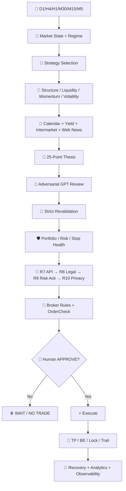
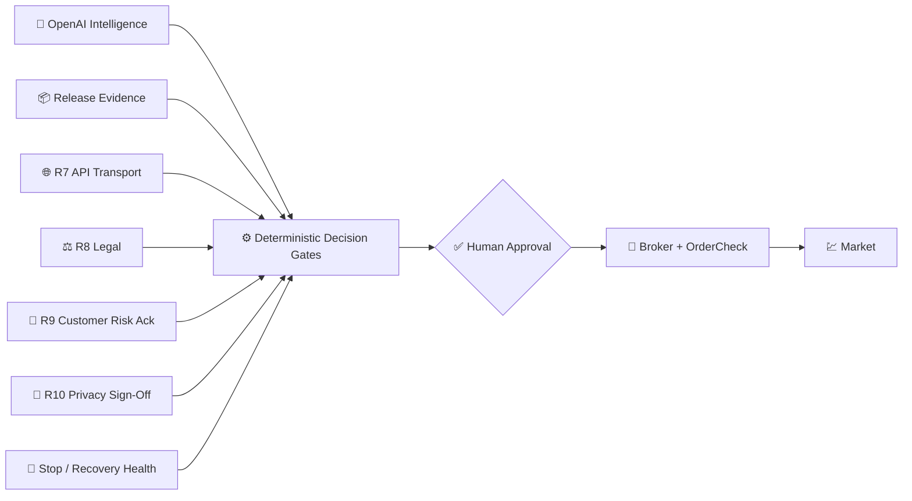
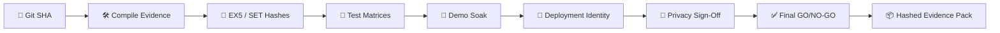

<!-- GPT_EA_DOC_HEADER -->
<div align="center">


<br>

[](#)
[](#)
[](#)
[](#)
[](#)

### 🧠 Multi-Timeframe Intelligence · 📰 News & Intermarket · 🛡️ Risk · ⚡ Execution · 💾 Recovery · 🔐 Release Governance

[🏗 Architecture](docs/ARCHITECTURE.md) · [🏛 ADRs](docs/ADR_INDEX.md) · [🚦 Release Truth](docs/RELEASE_TRUTH_DASHBOARD.md) · [🗺 Roadmap](docs/ROADMAP.md) · [🚀 Installation](docs/INSTALLATION.md) · [🔐 Privacy](docs/PRIVACY_DATA_RETENTION_REVIEW.md) · [📦 Release Evidence](docs/RELEASE_EVIDENCE_PACK.md) · [⚖️ Terms](docs/TERMS_AND_CONDITIONS.md)

</div>

---

# 🧠⚡ GPT_EA

**GPT_EA** is a standalone MetaTrader 5 Expert Advisor that combines deterministic trading logic with OpenAI-assisted market intelligence. It scans **D1 / H4 / H1 / M30 / M15 / M5**, classifies market regime and strategy, evaluates live news/intermarket risk, builds a mandatory trade thesis, challenges the setup with GPT, then routes any candidate through deterministic risk, broker, release, legal, customer-acknowledgement and privacy gates before human-approved execution.

> 🛡️ **Core rule:** AI can assist analysis; it cannot override broker rules, release evidence, stop protection, recovery integrity, risk limits, legal acknowledgement or human approval.

## ✨ Why GPT_EA is different

| Layer | Capability |
|---|---|
| 🧭 **Market intelligence** | D1→M5 structure, regime, trend/retracement/reversal/breakout/range classification |
| 🧠 **Strategy engine** | Continuation, retracement, counter-trend, reversal, breakout, breakout-retest, range, mean reversion |
| 📰 **Live context** | Economic calendar, yields, intermarket signals and OpenAI web intelligence |
| 🧾 **Trade thesis** | Mandatory 25-point thesis plus adversarial GPT review |
| 🔁 **Freshness** | Strict pre-entry revalidation cancels stale approvals |
| 🛡️ **Risk** | Portfolio, correlation, daily loss, drawdown, realistic R:R and broker-aware sizing |
| ⚡ **Execution** | Human APPROVE / DENY, `OrderCheck()`, broker-specific filling/stops/margin |
| 🛑 **Protection** | TP1/TP2, BE, profit lock, trailing, stop-failure policy and partial-protection hazard gate |
| 💾 **Recovery** | Restart-safe checkpointing, broker reconciliation and lifecycle replay |
| 🔐 **Governance** | R7 API → R8 Legal → R9 Customer Risk Ack → **R10 Privacy Sign-Off** |
| 📦 **Evidence** | Compile, static, tester, broker, soak, legal/privacy and final GO/NO-GO evidence packs |

## 🏗️ Architecture at a glance



Full architecture: **[docs/ARCHITECTURE.md](docs/ARCHITECTURE.md)**

## 🔐 Trust & governance stack



**No single AI response can force an order.** New-entry authorization remains fail-closed when a mandatory gate is missing or stale.

## 🚦 Release truth

**[Open the release-truth dashboard →](docs/RELEASE_TRUTH_DASHBOARD.md)** · Current checked-in baseline: **⏸️ HOLD** until exact-candidate external evidence is validated.

Dashboard integrity: **[drift-detection contract](docs/DASHBOARD_DRIFT_DETECTION.md)** · architecture governance: **[ADR supersession policy](docs/ADR_SUPERSESSION_POLICY.md)**.

| Item | Current contract |
|---|---|
| 🧬 Source identity | Exact Git SHA required |
| 🛠️ Compile | Real MetaEditor compile evidence required: **0 errors / 0 production warnings** |
| 🔏 Artifact identity | EX5 SHA-256 + SET SHA-256/NONE |
| 🧪 Validation | Strategy Tester + intelligence/broker/recovery/stop matrices |
| 🌐 API | DIRECT_OPENAI or validated proxy transport evidence |
| 🌊 Demo soak | Minimum 5 trading days + required session/event coverage |
| ⚖️ Legal | Versioned commercial/legal acknowledgement |
| 👤 Customer risk | Versioned no-profit/loss/AI/broker responsibility acknowledgements |
| 🔐 Privacy | **R10 jurisdiction-bound privacy sign-off** with zero critical findings |
| ✅ Final review | Machine-bound GO / HOLD / NO-GO |
| 📦 Archive | Hashed release-evidence pack |

> ⚠️ **Repository source does not equal live certification.** The current executable source still needs a fresh MetaEditor compile and complete evidence cycle after executable changes.

Local compile helper: **[docs/METAEDITOR_LOCAL_COMPILE.md](docs/METAEDITOR_LOCAL_COMPILE.md)** — runs the real MetaEditor compiler on Windows and extracts the first actionable errors into `metaeditor-first-errors.txt`.

## 🚀 Start here

```text
Install MT5
   ↓
Install GPT_EA
   ↓
Use your own funded OpenAI API account/key
   ↓
Allow https://api.openai.com in MT5 WebRequest
   ↓
Attach GPT_EA to DEMO
   ↓
Run docs/FIRST_RUN_CHECKLIST.md
   ↓
Complete release / broker / soak / legal / privacy evidence
   ↓
Final GO/NO-GO
   ↓
Controlled REAL deployment with human approval
```

New users: **[docs/INSTALLATION.md](docs/INSTALLATION.md)** · **[docs/USER_INSTALLATION_GUIDE.md](docs/USER_INSTALLATION_GUIDE.md)** · **[docs/FIRST_RUN_CHECKLIST.md](docs/FIRST_RUN_CHECKLIST.md)** · **[docs/API_KEY_TROUBLESHOOTING.md](docs/API_KEY_TROUBLESHOOTING.md)**

## 🗺️ Roadmap snapshot


Full roadmap: **[docs/ROADMAP.md](docs/ROADMAP.md)**

## 📦 Release evidence architecture



Key release documents:

- 🛠️ [docs/COMPILE_EVIDENCE_CHECKLIST.md](docs/COMPILE_EVIDENCE_CHECKLIST.md)
- 🔐 [docs/PRIVACY_SIGN_OFF.md](docs/PRIVACY_SIGN_OFF.md)
- 📦 [docs/RELEASE_EVIDENCE_PACK.md](docs/RELEASE_EVIDENCE_PACK.md)
- ✅ [docs/FINAL_GO_NO_GO_REVIEW.md](docs/FINAL_GO_NO_GO_REVIEW.md)
- 🧪 [docs/METAEDITOR_COMPILE_GATE.md](docs/METAEDITOR_COMPILE_GATE.md)

## ⚖️ Risk & legal notice

GPT_EA does **not** guarantee profit, wealth, income, winning trades or capital preservation. Trading can produce substantial losses, including loss of all capital allocated to trading. AI, brokers, APIs, market data and software can fail or be wrong.

Read: [docs/TRADING_RISK_DISCLOSURE.md](docs/TRADING_RISK_DISCLOSURE.md) · [docs/TERMS_AND_CONDITIONS.md](docs/TERMS_AND_CONDITIONS.md) · [COMMERCIAL_LICENSE.md](COMMERCIAL_LICENSE.md) · [docs/DISCLAIMER.md](docs/DISCLAIMER.md)

---

## Main EA

Compile only `GPT_EA.mq5` in MetaEditor. All 57 former project `.mqh` modules are already inlined; `mqh/` is retained only as a reference archive. The only executable include left in the EA is MT5's built-in `<Trade/Trade.mqh>`.

Core/legacy-compatible modules:

- `GPT_EA_Part01.mqh` — inputs, OpenAI client and core execution-family types
- `GPT_EA_Part02.mqh` — indicators, D1/H4/H1/M30/M15/M5 scoring and session scheduling
- `GPT_EA_Part03.mqh` — ATR/opening-range adaptation, economic calendar, yield and spread filters
- `GPT_EA_Part04.mqh` — base pullback/breakout-retest geometry and risk sizing
- `GPT_EA_Part05.mqh` — signal card and final order path
- `GPT_EA_Part06.mqh` — approval UI and legacy management helpers
- `GPT_EA_Part07.mqh` — full-intelligence scanner, approval flow and MT5 event hooks
- `GPT_EA_Part08_Advanced.mqh` — confluence, chart/dashboard and trade-level drawing
- `GPT_EA_Part09_RiskRecoveryAnalytics.mqh` — portfolio risk, DOM/ONNX, regime base, recovery and analytics
- `GPT_EA_Part10_BrokerUniversalRecovery.mqh` — broker/symbol abstraction and disk-backed recovery
- `GPT_EA_Part11_PreflightRecoveryGuard.mqh` — `OrderCheck()`, validated checkpoint backup and netting safety
- `GPT_EA_Part12_SafetyStopManagement.mqh` — hard release gates and advanced SL helpers
- `GPT_EA_Part13_AdvancedPositionManager.mqh` — restart-safe TP1/TP2, BE, profit locks and trailing
- `GPT_EA_Part14_StopFailurePolicy.mqh` — stop failure escalation and emergency protection

Full-intelligence modules:

- `GPT_EA_Part15_StrategyIntelligence.mqh` — market-state taxonomy, counter-trend/reversal/range engines, dynamic selector and strategy evidence
- `GPT_EA_Part15B_StrategyFrameworks.mqh` — named trend, retracement, session, breakout, reversal and mean-reversion frameworks
- `GPT_EA_Part15C_StrategyContextAnalytics.mqh` — strategy statistics by session, direction, volatility, timeframe and news proximity
- `GPT_EA_Part15D_StructureTargets.mqh` — liquidity/structure-aware TP refinement
- `GPT_EA_Part16_NewsIntermarket.mqh` — local intermarket confirmation and OpenAI web-search news intelligence
- `GPT_EA_Part16A_StrictRevalidation.mqh` — stale-strategy/direction/news/intermarket pre-entry cancellation
- `GPT_EA_Part17_ThesisEngine.mqh` — mandatory 25-point thesis and adversarial GPT review prompt
- `GPT_EA_Part18_StopBrokerObservability.mqh` — broker-specific stop failures, adaptive retry and partial-protection gate
- `GPT_EA_Part19_ContinuousIntelligence.mqh` — new-M5-bar/configurable continuous rescanning
- `GPT_EA_Part20_RealisticCostModel.mqh` — commission, spread, slippage and partial-weighted realistic R:R
- `GPT_EA_Part00_ForwardDeclarations.mqh` — compile-order declarations for cross-module hooks

Governance/release modules:

- `GPT_EA_Part28_ReleaseCertification.mqh` — base machine-readable release certification and artifact identity.
- `GPT_EA_Part29_DeploymentDriftGuard.mqh` — broker/server/account/symbol structural drift protection.
- `GPT_EA_Part37_APITransport.mqh` — direct/proxy OpenAI WebRequest transport and failure/backoff policy.
- `GPT_EA_Part38_LegalLicenseGate.mqh` — commercial terms/license acknowledgement.
- `GPT_EA_Part39_CustomerRiskAcknowledgement.mqh` — versioned customer trading-risk acknowledgement.
- `GPT_EA_Part40_PrivacyReleaseGate.mqh` — **R10 jurisdiction-bound privacy release sign-off**.


## Decision model

The EA is designed to return one of three operational states:

- **HIGH-CONFIDENCE TRADE SETUP**
- **WAIT FOR CONFIRMATION / REANALYZE**
- **NO TRADE**

A scan request does not force a trade.

## Market-state intelligence

The strategy engine explicitly distinguishes:

- trend continuation
- healthy retracement
- deep retracement
- correction
- counter-trend movement
- trend failure
- reversal
- breakout
- breakout-retest
- false breakout
- liquidity sweep
- range expansion
- range reversal
- mean reversion
- momentum continuation
- exhaustion
- possible accumulation
- possible distribution
- consolidation

These classifications describe current evidence; they are not guarantees of future direction.

## First-class strategy classifications

Before any entry recommendation the scanner assigns one of:

1. Trend Continuation
2. Retracement Entry
3. Counter-Trend Scalp
4. Counter-Trend Swing
5. Potential Reversal
6. Breakout
7. Breakout-Retest
8. Range Trade
9. Mean-Reversion Setup
10. No Trade

The original `SetupKind` remains as a backward-compatible execution/recovery family for pullback versus breakout-retest state. The new `StrategyClass` is the actual market-strategy classification.

## Strategy library and regime selection

The selector can identify frameworks such as:

- HH/HL or LH/LL continuation
- multi-timeframe trend alignment
- EMA/dynamic-support continuation
- pullback-to-structure
- momentum/volatility-expansion continuation
- support/resistance breakout
- breakout/retest
- opening-range breakout/retest
- previous-day high/low breakout
- Asian-range / London-open breakout
- U.S. cash opening-range breakout
- consolidation breakout
- moving-average retracement
- Fibonacci 38.2–61.8% retracement/value zone
- previous-breakout / previous-day structure retracement
- liquidity-sweep retracement
- failed breakout reversal
- liquidity sweep reversal
- double top/bottom + structural confirmation
- exhaustion + RSI divergence + CHOCH/BOS
- major support/resistance reversal
- London liquidity sweep reversal
- U.S. cash-session sweep/reversal
- range support/resistance trade
- failed range breakout
- session-range reversal
- mean reversion toward equilibrium/VWAP

The current regime is evaluated first; strategies are then ranked for that regime rather than forcing one pattern onto every chart.

## Retracement intelligence

A move against the dominant trend is not automatically called a reversal. The engine checks HTF votes, M15/M5 structure, EMA20/EMA50, ATR-normalized depth, swing range, Fibonacci value zone, previous-day/session structure, liquidity sweeps, divergence and lower-timeframe structure changes to distinguish healthy retracement, deep retracement, trend failure and reversal.

It also detects overextension/chasing risk and can return WAIT when a better retracement entry is structurally preferable.

## Counter-trend intelligence

Counter-trend setups use a higher score threshold and require stronger evidence such as exhaustion, overextension, major structure, sweep/fakeout, divergence, double top/bottom, CHOCH/BOS and M5 rejection. Strong HTF ADX penalizes counter-trend scoring.

A counter-trend candidate is explicitly labelled **COUNTER-TREND TRADE** and uses more conservative target geometry/expiry than ordinary trend-following setups.

## Multi-timeframe and technical evidence

Each scan uses **D1 / H4 / H1 / M30 / M15 / M5** and can evaluate:

- EMA20/EMA50
- RSI
- ATR
- ADX/+DI/-DI
- HH/HL/LH/LL swing structure
- break of structure / change of character
- liquidity sweeps
- FVGs
- sweep → displacement → retest
- rejection candles
- tick-volume impulse
- rolling VWAP
- previous-day highs/lows
- Asian/session ranges
- opening-range behavior
- level touches/rejections
- Fibonacci retracement context
- supply/demand structural proxies
- DOM where supplied by the broker
- optional ONNX probability

## Continuous and scheduled scanning

In addition to manual **SCAN NOW**, the EA supports continuous new-M5-bar/configurable interval scans and the session schedule:

- 08:55 London — pre-open
- 09:00 London — open
- configured hourly London scans
- 09:25 New York — pre-U.S.-cash-open
- 09:30 New York — U.S. cash open

New M5 bars can trigger a fresh full-intelligence scan while the web-news cache prevents unnecessary repeated web requests.

## Live news and fundamental intelligence

Before approval/execution the EA can combine:

1. MT5 native economic calendar;
2. Treasury-yield shock detection;
3. broker-local intermarket data;
4. OpenAI Responses API web search when enabled.

The live web layer requests current information on central-bank decisions and communication, CPI/PPI/inflation, NFP/employment/unemployment, GDP, PMI, retail sales, bond/yield changes, USD strength, geopolitical and unexpected economic/political headlines, company/sector developments where relevant, commodity/OPEC/inventory/supply-demand developments and other instrument-specific high-impact events.

The response must explain the **invalidation channel** rather than merely reporting that news exists. It returns a CLEAR/WATCH/BLOCK verdict. Configurable fail-open/fail-closed behavior applies if web intelligence is unavailable.

## Intermarket intelligence

Where the broker exposes relevant instruments, direction is cross-checked against combinations of:

- DXY/USD index
- U.S. 10-year yield
- VIX/volatility
- gold
- WTI/oil
- US100
- US500
- related FX behavior

Examples: gold can be checked against DXY/yields; U.S. indices against yields/VIX; FX against DXY and relevant rate context; crypto against USD/risk sentiment. Unavailable instruments are reported as unavailable rather than fabricated. A severe contradiction can block authorization.

## Realistic risk-to-reward

The final R:R gate models more than theoretical price distance. `GPT_EA_Part20_RealisticCostModel.mqh` incorporates:

- Bid/Ask spread
- dynamic modeled slippage / entry deviation
- historical per-symbol commission estimate where enough broker history exists
- configurable fallback round-turn commission per lot
- TP1 partial weighting
- TP2 partial weighting
- remaining runner/TP3 weighting

The execution path uses this realistic weighted ratio for final validation. Historical commission is evidence from the connected account; if unavailable the configured fallback is used rather than invented.

## Structure/liquidity-aware targets

Selected setups refine TP1/TP2/TP3 against available M15 swing, previous-day and Asian/session liquidity objectives, with measured-R fallback when no suitable structural objective exists. Counter-trend targets remain conservatively capped.

## Historical/internal strategy validation

Finalized strategy results are tracked by:

- strategy class
- market state
- long vs short
- volatility bucket
- session
- setup/execution timeframe context
- proximity to high-impact news

Metrics include trade count, win rate, average R/expectancy, profit factor, cumulative R, maximum drawdown in R and maximum consecutive losses.

Before the minimum sample, evidence is explicitly treated as developing—not proof of edge. After the configured sample threshold, negative expectancy/profit-factor evidence can block a strategy. Past results never guarantee future performance.

## Mandatory 25-point thesis

Every selected setup builds all required sections:

1. Multi-Timeframe Alignment
2. Market Regime
3. Market Structure
4. Strategy Selection
5. Trend vs Retracement Assessment
6. Entry Logic
7. Confirmation Logic
8. Stop-Loss Logic
9. Take-Profit Logic
10. Risk-to-Reward Analysis
11. Pullback vs Breakout-Retest
12. Counter-Trend Assessment
13. Liquidity & Fakeout Assessment
14. Volatility Analysis
15. News Risk Assessment
16. Treasury-Yield & Intermarket Analysis
17. Session Analysis
18. Time-Based Invalidation
19. Price-Based Invalidation
20. Counterargument Analysis
21. Setup Quality Filtering
22. Confidence Validation
23. Historical Strategy Validation
24. Pre-Entry Revalidation
25. Detailed Trade Thesis

The GPT secondary review is explicitly adversarial: it is instructed to attempt to disprove the trade, identify opposing evidence, distinguish retracement from reversal and breakout from fakeout/sweep, and return VALID / WAIT / INVALID. GPT never overrides deterministic safety/risk/broker gates.

## Pre-entry revalidation

Immediately before execution the EA rechecks:

- strategy identity and direction
- D1/H4/H1/M30/M15/M5 synchronized market data
- current price/entry-zone integrity
- strategy-specific M5 confirmation
- spread and realistic R:R
- ATR/opening range
- native economic calendar
- forced fresh live web news intelligence
- Treasury-yield shock
- local intermarket contradiction
- historical strategy evidence gate
- release/recovery invariants
- partial-protection stop hazard
- portfolio/daily risk
- broker rules and `OrderCheck()`

If the strategy class or direction changes, stale approval is cancelled and the market must be reanalyzed.

## Broker-universal execution

The EA resolves common broker aliases/suffixes/prefixes and reads actual runtime symbol/account properties: point/tick size, tick values, contract size, volume rules, spread, stops/freeze levels, trade/execution/filling modes, margin currencies, account leverage/margin mode and broker margin requirements.

Risk sizing uses `OrderCalcProfit()`. Margin validation uses broker calculations and `OrderCheck()` instead of assuming one leverage formula fits all instruments.

## Portfolio/risk/release controls

Protections include:

- symbol/portfolio/correlated-risk caps
- daily equity-loss limit
- equity high-water drawdown limit
- consecutive-loss limit
- cooldowns
- stale/unsynchronized-data gate
- terminal/account/EA permission gate
- explicit real-account arm phrase
- broker capability/margin/filling gates
- stop/recovery invariants
- manual PAUSE/RESUME

Existing positions continue to be managed when new entries are blocked.

## Advanced stop management

The monotonic protection sequence is:

**Initial structural SL → cost-aware BE → profit lock → strong lock → ATR/M5-structure trail**.

TP1/TP2 partials are idempotent by `POSITION_IDENTIFIER`. BUY SL never intentionally moves down; SELL SL never intentionally moves up. Broker stop/freeze rules are rechecked before every modification. A missing SL is critical and can trigger emergency closure if repair fails.

## Broker-specific stop failures and observability

`GPT_EA_Part18_StopBrokerObservability.mqh` classifies stop failures such as invalid stops, frozen zone, market closed, requote/price changed, no quotes, connection, rate limit, trading disabled, invalid volume/price/fill and other broker rejection.

Retry cadence adapts to the failure class. Material failures are written to `GPT_EA_StopFailures.csv` with broker/server, position ID, retcode, spread, stop/freeze level, current/proposed protection, TP state, failure count and retry policy.

A TP1 partial that remains without completed BE protection beyond `InpPartialProtectionMaxSeconds` becomes a **partial-protection hazard** and can block all new entries while the existing position continues repair/management.

## Restart/VPS recovery

Recovery reconciles current broker positions/history, position-identifier globals, ticket-scoped state, account/magic-specific checkpoint and validated `.bak`. Completed snapshots carry an `END` marker. Pending approvals are never blindly executed after restart; they must pass fresh full-intelligence validation.

## Approval flow

**Continuous/scheduled scan → market-state classification → strategy selection → technical/confluence analysis → historical evidence → calendar/yield → live web news → intermarket → mandatory 25-point thesis → adversarial GPT review → release/stop/portfolio/broker gates → strategy-specific entry trigger → APPROVE/DENY → forced fresh revalidation → OrderCheck → execution.**

Only a fully aligned candidate reaches **HIGH-CONFIDENCE TRADE SETUP**. Otherwise the correct output is WAIT/REANALYZE or NO TRADE.

## Release/test documents

- `docs/COMPILE_TEST_CHECKLIST.md`
- `docs/BROKER_MATRIX_TESTS.md`
- `docs/RECOVERY_INVARIANTS.md`
- `docs/RELEASE_SAFETY_GATES.md`
- `docs/STOP_MANAGEMENT_TEST_MATRIX.md`
- `docs/STOP_UPDATE_FAILURE_POLICY.md`
- `docs/BROKER_STOP_FAILURE_POLICY.md`
- `docs/PARTIAL_PROTECTION_RELEASE_TEST.md`
- `docs/STOP_FAILURE_OBSERVABILITY.md`
- `docs/ANALYTICS_SCHEMA.md`
- `docs/ADVANCED_INTELLIGENCE_CONTRACT.md`
- `docs/INTELLIGENCE_TEST_MATRIX.md`

## Customer rollout, licensing and legal package

Customer distribution is supported by:

- `docs/CUSTOMER_SUPPORT_RUNBOOK.md`
- `docs/CUSTOMER_RELEASE_READINESS_CHECKLIST.md`
- `COMMERCIAL_LICENSE.md`
- `docs/TERMS_AND_CONDITIONS.md`
- `docs/TRADING_RISK_DISCLOSURE.md`
- `docs/DISCLAIMER.md`
- `docs/ANTI_PIRACY_LICENSE_ENFORCEMENT.md`
- `docs/JURISDICTION_LEGAL_REVIEW_CHECKLIST.md`
- `docs/CUSTOMER_RISK_ACKNOWLEDGEMENT_FLOW.md`

The R10 privacy sign-off gate sits on top of R9 customer-risk acknowledgement, R8 legal/license acknowledgement and the R7 API/release guard. REAL-account new entries remain blocked until the customer legal/risk acknowledgements are valid **and** the release has a jurisdiction-matched privacy sign-off with zero unresolved critical privacy findings. Demo/Strategy Tester remain available for evaluation. Governance failure must never weaken management of already-open positions.

## Documentation architecture

- 🏛️ `docs/ADR_INDEX.md` — accepted architecture decisions and rationale.
- 🚦 `docs/RELEASE_TRUTH_DASHBOARD.md` — evidence-derived PASS/HOLD/NO-GO summary.
- 🔄 `docs/ADR_SUPERSESSION_POLICY.md` — ADR replacement, history-preservation and cycle rules.
- 🧭 `docs/ADR_TEMPLATE.md` / `ADR_REGISTRY.json` — new-decision template and machine-readable ADR graph.
- 🧪 `docs/DASHBOARD_DRIFT_DETECTION.md` — evidence/dashboard fingerprint integrity contract.

- 🏗️ `docs/ARCHITECTURE.md` — end-to-end system and trust-boundary diagrams.
- 🗺️ `docs/ROADMAP.md` — capability roadmap and promotion guardrails.
- 🔐 `docs/PRIVACY_DATA_RETENTION_REVIEW.md` — privacy inventory, retention and incident review.
- 📦 `docs/RELEASE_EVIDENCE_PACK.md` — canonical release archive structure and pack generator.

Every repository Markdown file uses the shared **🧠⚡ GPT_EA** documentation lockup and navigation header. `tools/check_documentation_branding.py` prevents unbranded Markdown from silently entering the release documentation set.

## Installation and onboarding

New users should start with:

- `docs/INSTALLATION.md` — quick installation path.
- `docs/USER_INSTALLATION_GUIDE.md` — complete new-user setup guide.
- `docs/FIRST_RUN_CHECKLIST.md` — first-run PASS/FAIL checklist.
- `docs/API_KEY_TROUBLESHOOTING.md` — safe OpenAI API/WebRequest troubleshooting.
- `docs/OPENAI_ACCOUNT_RECOMMENDATION.md` — ChatGPT Pro 20X companion recommendation and API model guidance.

Current API model ladder includes `gpt-5.6-luna`, `gpt-5.6-terra`, `gpt-5.6-sol`, and `gpt-6-astra`. OpenAI currently positions GPT-6 Astra as its flagship maximum-intelligence API model for the hardest end-to-end work. Users should choose it only when the additional API cost/latency is acceptable.

## OpenAI configuration

Enter the API key locally in MT5 inputs and never commit it. Add under **Tools → Options → Expert Advisors → Allow WebRequest for listed URL**:

```text
https://api.openai.com
```

WebRequest/web-search intelligence is unavailable in Strategy Tester; test deterministic logic there and validate live-news behavior on demo.

## Release rule

Source presence is not proof of a production-ready EA. Required progression:

**MetaEditor 0-error compile → warnings reviewed → Strategy Tester/static checks → intelligence matrix → broker matrix → recovery matrix → stop-management HIGH-priority matrix → partial-protection test → live-news/intermarket demo test → multi-session demo soak → explicit real-account arming → conservative live release with approval required.**

## Project separation

`GPT_EA` is independent and has no runtime dependency on CelestialNexus or any other repository.
