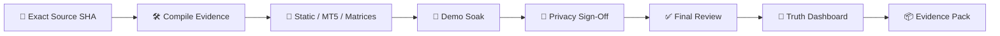

<!-- GPT_EA_DOC_HEADER -->
<div align="center">

# 🧠⚡ GPT_EA
### 🚦 Release-Truth Dashboard

**AI-Assisted MT5 Intelligence • Risk • Execution • Recovery • Governance**

[🏠 Home](README.md) · [🏗 Architecture](ARCHITECTURE.md) · [🗺 Roadmap](ROADMAP.md) · [🔐 Privacy](PRIVACY_DATA_RETENTION_REVIEW.md) · [📦 Release Evidence](RELEASE_EVIDENCE_PACK.md)

</div>

> 🚦 **Document:** `RELEASE_TRUTH_DASHBOARD.md`

---

# 🚦 Release-Truth Dashboard

> **Overall candidate state: ⏸️ HOLD**

This checked-in dashboard is the repository **baseline generated from the intentionally unapproved release-evidence template**. It reports evidence state; it does not estimate profitability or infer production readiness from source-code presence.

## 🧬 Baseline identity

- **Release validation ID:** `GPT_EA_FULL_INTELLIGENCE_R6_20260917`
- **Evidence Git SHA:** placeholder / not certified
- **Repository HEAD observed for this baseline:** `ce70f44c9b0f785513e763c57f492461baa03046`
- **Evidence source:** `RELEASE_EVIDENCE_TEMPLATE.json`
- **External MetaEditor compile:** not represented as PASS

## 📊 Release truth

| Release truth | Status | Current evidence | Required for PASS |
|---|---|---|---|
| 🧬 **Source identity** | ⏸️ HOLD | candidate Git SHA is placeholder | exact candidate SHA + archived artifact identity |
| 🛠️ **MetaEditor compile** | ⏸️ HOLD | compile and compile-evidence gates are false | real 0-error/0-warning compile + validated compile record |
| 🤖 **Executed CI / runner** | ⏸️ HOLD | runner ID is 0 / no accepted executed bundle | allocated runner + executed/attested CI bundle |
| 🧪 **MT5 validation** | ⏸️ HOLD | gate false | validated MT5 evidence |
| 🧪 **Strategy Tester** | ⏸️ HOLD | gate false | exact-candidate tester PASS |
| 🧠 **Intelligence matrix** | ⏸️ HOLD | gate false | required intelligence matrices PASS |
| 🏦 **Broker / deployment** | ⏸️ HOLD | broker/deployment gates false | broker matrix + deployment identity PASS |
| 💾 **Recovery** | ⏸️ HOLD | gate false | restart/recovery validation PASS |
| 🛑 **Stop management** | ⏸️ HOLD | gate false | stop-management matrix PASS |
| 📊 **Stop observability** | ⏸️ HOLD | gate false | observability evidence PASS |
| 🌐 **API transport** | ⏸️ HOLD | WebRequest/matrix evidence not approved | transport matrix + tracing/failure recovery + zero leaks |
| 🌊 **Five-day demo soak** | ⏸️ HOLD | soak gate false | schema-valid exact-candidate soak PASS |
| 🔐 **R10 privacy sign-off** | ⏸️ HOLD | privacy gate false, telemetry UNSET | jurisdiction-matched validated privacy sign-off |
| ✅ **Final GO/NO-GO** | ⏸️ HOLD | decision is HOLD | machine-validated final decision GO |

## ⛔ Explicit blockers

- No explicit failure is being converted into a PASS.
- The current baseline is **HOLD** because required external/candidate evidence is intentionally incomplete.
- HOLD must never arm REAL-account new entries.

## 🎛️ Status semantics

- **✅ PASS** — explicit required evidence says PASS and its identity/validation fields are present.
- **⏸️ HOLD** — evidence is missing, placeholder, incomplete, unvalidated or not yet authorized.
- **⛔ NO-GO** — explicit failure, critical finding, identity mismatch, secret exposure or failed final decision.
- **Source/docs/code presence alone never produces PASS.**

## 🔄 Generate for a real candidate

```text
python tools/generate_release_truth_dashboard.py release_evidence.json --output RELEASE_TRUTH_DASHBOARD.md

# Final release consistency gate (fails unless overall state is PASS)
python tools/generate_release_truth_dashboard.py release_evidence.json --output RELEASE_TRUTH_DASHBOARD.md --require-pass
```

For the repository baseline:

```text
python tools/generate_release_truth_dashboard.py RELEASE_EVIDENCE_TEMPLATE.json --output RELEASE_TRUTH_DASHBOARD.md
```

## 🧬 Truth pipeline



## 🔐 Authority

The dashboard is a summary surface. Canonical authority remains:

- machine-readable evidence files;
- dedicated validators;
- exact artifact hashes;
- final GO/NO-GO review;
- archived release-evidence pack.

---

> 🚦 **Truth principle:** missing evidence is HOLD, explicit critical failure is NO-GO, and only validated evidence can become PASS.
