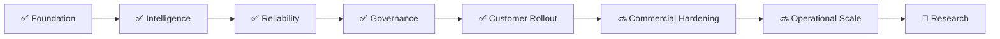

<!-- GPT_EA_DOC_HEADER -->

# 🧠⚡ GPT_EA
### 🗺️ Product & Engineering Roadmap

[🏠 Home](README.md) · [🏗 Architecture](ARCHITECTURE.md) · [🗺 Roadmap](ROADMAP.md) · [🔐 Privacy](PRIVACY_DATA_RETENTION_REVIEW.md) · [📦 Release Evidence](RELEASE_EVIDENCE_PACK.md)

---

# 🗺️ Roadmap

The roadmap is capability-focused, not a promise of dates or profitability. Release promotion requires evidence, not feature count.

## ✅ Phase 1 — Core trading intelligence
- D1/H4/H1/M30/M15/M5 analysis.
- Market-state and regime classification.
- Dynamic strategy selection.
- Human APPROVE / DENY control.

## ✅ Phase 2 — Deep intelligence
- OpenAI adversarial review.
- Live news/web intelligence.
- Treasury-yield and intermarket checks.
- Mandatory 25-point thesis.
- Strict pre-entry revalidation.

## ✅ Phase 3 — Execution resilience
- Broker-universal abstraction.
- Stop-failure policy and observability.
- Partial-protection lifecycle.
- Restart-safe TP/BE/trailing.
- Recovery/checkpoint reconciliation.

## ✅ Phase 4 — Release governance
- Compile gate.
- Static and matrix testing.
- Demo-soak acceptance.
- Deployment-drift checks.
- Machine-readable evidence.
- Final GO / HOLD / NO-GO review.

## ✅ Phase 5 — Customer rollout
- Customer-owned API keys.
- First-run onboarding.
- Support runbook.
- Commercial license / terms / disclaimer.
- Anti-piracy policy.
- R8 legal acknowledgement.
- R9 customer risk acknowledgement.
- Jurisdiction legal-review framework.

## 🔜 Phase 6 — Commercial hardening
- Signed customer entitlement.
- Cryptographic license verification.
- Account/server scope and revocation.
- Offline grace policy.
- Privacy-minimized licensing.
- Signed release manifests.

## 🔜 Phase 7 — Operational scale
- Release-evidence pack generator.
- Privacy-safe support bundle generator.
- Structured incident IDs.
- Version/update notices.
- Optional privacy-reviewed telemetry.
- Support dashboard and SLA metrics.

## 🧪 Phase 8 — Research
- Champion/challenger experiments.
- Shadow-only model testing.
- Regime-specific evidence.
- Post-trade causal review.
- Cost/slippage calibration.
- Adaptive risk only after evidence and release approval.

## 🚫 Roadmap guardrails
- No bypass of human approval during protected rollout.
- No weakening of stop protection.
- No blind approval when required intelligence is missing.
- No vendor collection of customer API keys for convenience.
- No licensing failure that endangers open positions.
- No guaranteed-return marketing.
- No direct promotion of experimental models to live without evidence.

---

> 🚦 **Promotion rule:** research → shadow → demo → soak → evidence → review → controlled live.
