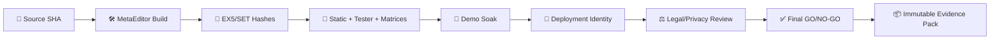

<!-- GPT_EA_DOC_HEADER -->
<div align="center">

# 🧠⚡ GPT_EA
### 📦 Release Evidence Pack

[🏠 Home](README.md) · [🏗 Architecture](ARCHITECTURE.md) · [🗺 Roadmap](ROADMAP.md) · [🔐 Privacy](PRIVACY_DATA_RETENTION_REVIEW.md) · [📦 Release Evidence](RELEASE_EVIDENCE_PACK.md)

</div>

---

# 📦 Release Evidence Pack

The release-evidence pack is the canonical archive proving exactly **what was built, tested, reviewed and authorized**. It proves engineering/release process, not profitability.

## 🗂️ Recommended pack structure

```text
GPT_EA_RELEASE_<RELEASE_ID>/
├── 00_identity/
│   ├── git-sha.txt
│   ├── release-id.txt
│   ├── source-manifest.txt
│   └── release-notes.md
├── 01_build/
│   ├── GPT_EA.ex5
│   ├── GPT_EA.ex5.sha256
│   ├── certified.set
│   ├── certified.set.sha256
│   ├── metaeditor-compile.log
│   ├── compile-evidence.json
│   └── compile-evidence-validation.txt
├── 02_static_ci/
│   ├── static-check.txt
│   └── ci-run-reference.txt
├── 03_strategy_tester/
├── 04_broker_matrix/
│   ├── broker-agnostic-coverage.json
│   └── broker-agnostic-coverage-validation.txt
├── 05_intelligence/
├── 06_execution_recovery/
├── 07_demo_soak/
├── 08_deployment/
├── 09_legal_privacy/
│   ├── privacy-signoff.json
│   ├── privacy-signoff-validation.txt
│   └── jurisdiction-review-reference.txt
├── 10_final_review/
└── 99_manifest/
    ├── release-evidence-validation.txt
    ├── evidence-pack-manifest.sha256
    ├── release-truth-dashboard.md
    ├── release-truth-drift-validation.txt
    └── archive-index.txt
```

## 🧬 Evidence chain



## 🔏 Identity requirements
- exact Git SHA;
- exact release ID;
- MetaEditor build;
- MT5 build;
- EX5 SHA-256;
- SET SHA-256 or explicit NONE;
- broker/server/deployment profile;
- evidence-validator versions;
- legal/risk terms versions.

Never accept screenshots alone as artifact identity.

## 🧪 Mandatory evidence groups

### 🛠️ 1. Build
- `COMPILE_EVIDENCE_CHECKLIST.md` complete.
- `tools/validate_compile_evidence.py` PASS.
- 0-error MetaEditor compile evidence.
- warning review.
- EX5 artifact and hash.
- production preset and hash.

### 🤖 2. Static / CI
- offline aggregate static check.
- CI evidence where runner available.
- checker/version synchronization.

### 🧪 3. Strategy Tester
- deterministic scope.
- tester build/settings.
- expected exclusions such as live WebRequest.

### 🏦 4. Broker / deployment
- complete broker catalogue discovery outside Market Watch where applicable.
- selected/rechecked symbol count and per-class counts.
- `broker_agnostic_coverage_v1` evidence + validator PASS.
- class-scoped REAL authorization for broker-present asset classes.
- zero unresolved ambiguous mappings/misclassifications.
- OTHER/GEN fail-closed unless exhaustively certified.
- symbol properties.
- account/margin mode.
- filling/execution.
- stops/freeze.
- deployment-drift baseline.

### 🧠 5. Intelligence / API
- API transport test matrix.
- live news/intermarket evidence.
- failure/recovery traces.
- zero secret leakage.

### 🛑 6. Stop / recovery
- stop-management matrix.
- failure observability.
- partial protection.
- restart recovery.
- zero unresolved critical states.

### 🌊 7. Demo soak
- schema-valid soak evidence.
- required sessions/events.
- zero duplicate execution.
- zero release bypass.
- zero unresolved critical protection.

### ⚖️ 8. Legal / privacy
- `PRIVACY_SIGN_OFF.md` complete.
- `tools/validate_privacy_signoff.py` PASS.
- target-jurisdiction legal-review reference.
- terms/risk schema versions.
- privacy/data-retention review reference.
- no customer secrets stored in evidence pack.

### ✅ 9. Final review
- exact candidate identity.
- GO/HOLD/NO-GO.
- reviewer.
- validation digest.

## 🔐 Secret-exclusion rule

The evidence pack must **never** contain OpenAI API keys, MT5 passwords, proxy tokens, payment credentials, private signing keys or unredacted secret-bearing `.set` files.

If a secret enters the pack: revoke/rotate it, remove it, regenerate affected artifacts and document the incident.

## 🧾 Pack manifest

Create a flat index:

```text
relative_path | sha256 | size_bytes | evidence_type | generated_by | timestamp_utc
```

Then hash the completed manifest itself.

## 🏛️ Architecture decision evidence

Archive the active architecture-decision graph with the release:

- `ADR_REGISTRY.json`
- `ADR_INDEX.md`
- `ADR_SUPERSESSION_POLICY.md`

The static architecture checker must PASS so ADR IDs, statuses and supersession links are internally consistent.

## 🚦 Dashboard integrity

See `DASHBOARD_DRIFT_DETECTION.md`. The dashboard is a derived artifact and must match the evidence SHA/fingerprint used to generate it.

## 🚦 Final acceptance
- [ ] Candidate identity exact.
- [ ] Compile evidence passes.
- [ ] Required matrices pass.
- [ ] Broker-agnostic coverage evidence validates and class flags match intended live markets.
- [ ] Soak evidence validates.
- [ ] Deployment identity validates.
- [ ] Legal/privacy references present.
- [ ] Final GO decision valid.
- [ ] Mandatory validators pass.
- [ ] Secret scan clean.
- [ ] Archive manifest hashed.
- [ ] Candidate release-truth dashboard generated from the same evidence JSON.
- [ ] Dashboard drift detector PASS for the same evidence/dashboard pair.
- [ ] Pack stored in immutable/versioned archive.

## 🤖 Pack generator

Before building the pack, validate the compile and privacy records:

```text
python tools/validate_compile_evidence.py artifacts/compile-evidence.json
python tools/validate_broker_coverage_evidence.py artifacts/broker-agnostic-coverage.json
python tools/validate_privacy_signoff.py artifacts/privacy-signoff.json
python tools/validate_release_evidence_r10.py release_evidence.json
python tools/validate_final_release_review_r10.py release_evidence.json final_release_review.json
```

Use `RELEASE_EVIDENCE_PACK_TEMPLATE.json` as the input manifest and run:

```text
python tools/generate_release_truth_dashboard.py release_evidence.json --output RELEASE_TRUTH_DASHBOARD.md
python tools/check_architecture_release_truth.py
python tools/check_release_truth_drift.py release_evidence.json --dashboard RELEASE_TRUTH_DASHBOARD.md --output release-truth-drift-validation.txt
python tools/build_release_evidence_pack.py RELEASE_EVIDENCE_PACK_TEMPLATE.json
```

The generator verifies required files, prevents path escape outside the configured source root, scans for common secret patterns, copies evidence into a clean pack, hashes every artifact, writes `archive-index.json` / `archive-index.txt`, and creates `evidence-pack-manifest.sha256`.

It deliberately does **not** claim that MetaEditor, Strategy Tester, soak or legal evidence passed; it only packages artifacts that actually exist.

## 🤖 Recommended automation

A future release-pack generator should verify required files, compute SHA-256 for every artifact, reject secrets/missing evidence, create the archive index, write the pack digest and never mark external gates PASS without the actual artifacts.

---

> 📦 **Release truth:** no evidence, no certification; changed source, new evidence cycle.


## 🧪 Release hardening evidence

The customer-facing release pack is not complete until the following exact-candidate evidence is present and validated:

- `artifacts/release-candidate-smoke.json`
- `artifacts/release-candidate-smoke-validation.txt`
- `artifacts/fail-closed-recovery-drill.json`
- `artifacts/fail-closed-recovery-drill-validation.txt`
- `artifacts/demo-validation-run.json`
- `artifacts/demo-validation-run-validation.txt`
- secret-scan output showing zero detected live secrets
- evidence-retention policy review reference
- security threat-model / prompt-injection review reference

Validation commands:

```text
python tools/validate_release_candidate_smoke.py artifacts/release-candidate-smoke.json
python tools/validate_fail_closed_recovery_drill.py artifacts/fail-closed-recovery-drill.json
python tools/validate_demo_validation_harness.py artifacts/demo-validation-run.json
python tools/scan_release_secrets.py GPT_EA.mq5 docs COMMERCIAL_LICENSE.md
```

The package builder may run only after authoritative R10 release/final-review validators and release-truth `--require-pass` succeed:

```text
python tools/build_customer_release_package.py \
  --release-evidence release_evidence.json \
  --final-review final_release_review.json \
  --ex5 artifacts/GPT_EA.ex5 \
  --output dist/GPT_EA_<release>
```

An external signature can be included with `--signature-file`; `--require-signature` makes its absence fatal. Private signing keys must never be stored in the repository or customer package.

> 🧊 During feature freeze, these additions validate the candidate; they do not authorize new strategy/runtime changes.
