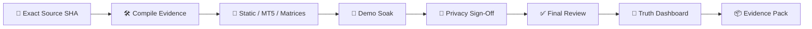

<!-- RELEASE_TRUTH_SCHEMA: gpt_ea_release_truth_v1 -->
<!-- RELEASE_TRUTH_EVIDENCE_SHA256: b35149001885b28844758b92295ab454e554046ac8a02e0fac042c3d61248793 -->
<!-- RELEASE_TRUTH_FINGERPRINT: f5a48f38590b2a5496101549c60ef30f8850c59ea7f80a54b5563c8ec909e44b -->
<!-- RELEASE_TRUTH_OVERALL: ⏸️ HOLD -->
<!-- GPT_EA_DOC_HEADER -->
<div align="center">

# 🧠⚡ GPT_EA
### 🚦 Release-Truth Dashboard

**AI-Assisted MT5 Intelligence • Risk • Execution • Recovery • Governance**

[🏠 Home](README.md) · [🏗 Architecture](ARCHITECTURE.md) · [🗺 Roadmap](ROADMAP.md) · [🔐 Privacy](PRIVACY_DATA_RETENTION_REVIEW.md) · [📦 Release Evidence](RELEASE_EVIDENCE_PACK.md)

</div>

> 🚦 **Document:** `RELEASE_TRUTH_DASHBOARD.md`

---

# 🚦 Release-Truth Dashboard

> **Overall candidate state: ⏸️ HOLD**

This checked-in dashboard is the repository **baseline generated from the intentionally unapproved release-evidence template**. It reports evidence state; it does not estimate profitability or infer production readiness from source-code presence.

## 🧬 Baseline identity

- **Release validation ID:** `GPT_EA_FULL_INTELLIGENCE_R6_20260917`
- **Evidence Git SHA:** placeholder / not certified
- **Repository HEAD observed for this baseline:** `f55c031663b3c4796df098b35eda3b145f0ea6ec`
- **Evidence source:** `RELEASE_EVIDENCE_TEMPLATE.json`
- **External MetaEditor compile:** not represented as PASS

## 📊 Release truth

| Release truth | Status | Current evidence | Required for PASS |
|---|---|---|---|
| **Source identity** | ⏸️ HOLD | candidate Git SHA is missing/placeholder | Record the exact 40-character candidate SHA. |
| **MetaEditor compile** | ⏸️ HOLD | real compile evidence is not fully validated | Compile exact candidate in MetaEditor and validate compile-evidence.json. |
| **Executed CI / runner** | ⏸️ HOLD | no allocated runner evidence (runner_id=0 or absent) | Obtain an actually executed runner/job bundle. |
| **Release-candidate smoke** | ⏸️ HOLD | gates.release_candidate_smoke=false / validated=false | Execute and validate exact-candidate evidence. |
| **Fail-closed recovery drill** | ⏸️ HOLD | gates.fail_closed_recovery_drill=false / validated=false | Execute and validate exact-candidate evidence. |
| **Demo validation harness** | ⏸️ HOLD | gates.demo_validation_harness=false / validated=false | Execute and validate exact-candidate evidence. |
| **MT5 validation** | ⏸️ HOLD | gates.mt5_validation=false | Complete and validate required evidence. |
| **Strategy Tester** | ⏸️ HOLD | gates.strategy_tester=false | Complete and validate required evidence. |
| **Intelligence matrix** | ⏸️ HOLD | gates.intelligence_matrix=false | Complete and validate required evidence. |
| **Broker/deployment** | ⏸️ HOLD | gates.broker_matrix=false | Complete and validate required evidence. |
| **Recovery** | ⏸️ HOLD | gates.recovery=false | Complete and validate required evidence. |
| **Stop management** | ⏸️ HOLD | gates.stop_matrix=false | Complete and validate required evidence. |
| **Stop observability** | ⏸️ HOLD | gates.stop_observability=false | Complete and validate required evidence. |
| **API transport** | ⏸️ HOLD | API transport evidence is incomplete | Complete WebRequest/matrix/failure-recovery evidence. |
| **Five-day demo soak** | ⏸️ HOLD | soak gate/evidence digest not validated | Complete exact-candidate five-day soak and schema validation. |
| **R10 privacy sign-off** | ⏸️ HOLD | privacy sign-off is missing/unvalidated | Complete jurisdiction-matched privacy sign-off. |
| **Security review** | ⏸️ HOLD | security review evidence is incomplete | Complete threat-model, secret-scan and prompt-injection review. |
| **Evidence retention** | ⏸️ HOLD | retention register/policy review is incomplete | Approve retention register for target jurisdiction. |
| **Final GO/NO-GO** | ⏸️ HOLD | decision=HOLD | Complete final review only after all prerequisite evidence passes. |

## ⛔ Explicit blockers

- No explicit failure is being converted into a PASS.
- The current baseline is **HOLD** because required external/candidate evidence is intentionally incomplete.
- HOLD must never arm REAL-account new entries.

## 🎛️ Status semantics

- **✅ PASS** — explicit required evidence says PASS and its identity/validation fields are present.
- **⏸️ HOLD** — evidence is missing, placeholder, incomplete, unvalidated or not yet authorized.
- **⛔ NO-GO** — explicit failure, critical finding, identity mismatch, secret exposure or failed final decision.
- **Source/docs/code presence alone never produces PASS.**

## 🔄 Generate for a real candidate

```text
python tools/generate_release_truth_dashboard.py release_evidence.json --output RELEASE_TRUTH_DASHBOARD.md

# Final release consistency gate (fails unless overall state is PASS)
python tools/generate_release_truth_dashboard.py release_evidence.json --output RELEASE_TRUTH_DASHBOARD.md --require-pass
```

For the repository baseline:

```text
python tools/generate_release_truth_dashboard.py RELEASE_EVIDENCE_TEMPLATE.json --output RELEASE_TRUTH_DASHBOARD.md
```

## 🧬 Truth pipeline



## 🔐 Authority

The dashboard is a summary surface. Canonical authority remains:

- machine-readable evidence files;
- dedicated validators;
- exact artifact hashes;
- final GO/NO-GO review;
- archived release-evidence pack.

---

> 🚦 **Truth principle:** missing evidence is HOLD, explicit critical failure is NO-GO, and only validated evidence can become PASS.
