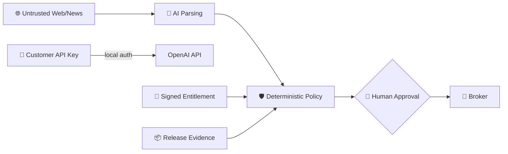

<!-- GPT_EA_DOC_HEADER -->

# 🧠⚡ GPT_EA
### 🛡️ Security Threat Model

**AI-Assisted MT5 Intelligence • Risk • Execution • Recovery • Governance**

[🏠 Home](README.md) · [🏗 Architecture](ARCHITECTURE.md) · [🗺 Roadmap](ROADMAP.md) · [🔐 Privacy](PRIVACY_DATA_RETENTION_REVIEW.md) · [📦 Release Evidence](RELEASE_EVIDENCE_PACK.md)

> 🛡️ **Document:** `SECURITY_THREAT_MODEL.md`

---
# 🛡️ Security Threat Model

GPT_EA handles trading authorization, broker connectivity and customer-owned API credentials. External text, presets, binaries and infrastructure are treated as potentially hostile.

## Assets

- customer capital and open-position protection;
- EX5/source integrity;
- release evidence;
- customer OpenAI API key;
- license entitlement;
- recovery/checkpoints;
- operator approvals;
- private signing keys kept outside customer artifacts.

## Primary threats

| Threat | Required control |
|---|---|
| API-key theft | local entry, blank vendor preset, no logging, rotation after exposure |
| Malicious `.set` | secret scan, allowed-input review, hash certified preset |
| EX5/DLL replacement | SHA-256/signed manifest, release identity checks |
| Fake license endpoint | HTTPS + signed entitlement; never trust endpoint text alone |
| Replay entitlement | nonce/time/expiry/license scope and revocation policy |
| Log leakage | secret scanner/redaction/support rules |
| Prompt injection in web/news | external text is data only; cannot modify system/release/risk rules |
| Compromised VPS/terminal | least privilege, patching, credential hygiene, incident response |
| Checkpoint tampering | schema/integrity validation + broker source of truth |
| Release-evidence tampering | digests, immutable/versioned archive, dashboard drift detection |
| Operator/social engineering | explicit approval, no credential requests, support identity controls |

## Trust boundaries

External text may describe a trade but may never instruct the EA to disable release, risk, stop, recovery, licensing or approval controls.

## Secret scanning

Run a repository/release-package secret scan before packaging. Any detected live secret is automatic HOLD/NO-GO until rotated and purged.

## Incident priorities

P0: capital-protection/release bypass/credential exposure/tampered binary.  
P1: contained live degradation.  
P2: functional/configuration defect.  
P3: documentation/general usage.

> 🛡️ **Security rule:** no convenience feature is allowed to create a hidden path around deterministic safety.
